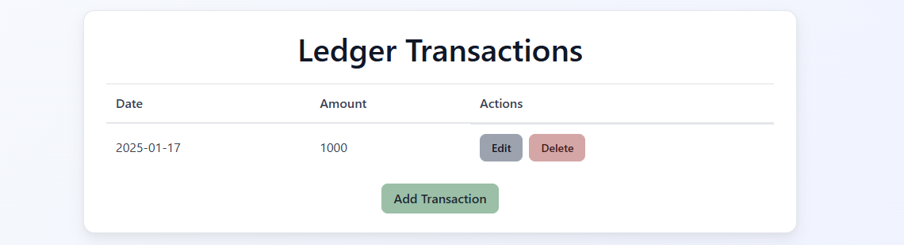

# Ledger App – AWS ECS Portfolio Project

Ledger App is a minimal transactional ledger service built as a **reference portfolio project** to demonstrate an **end‑to‑end, production‑style AWS ECS architecture** built entirely with **CloudFormation (nested stacks)** and deployed via **CodePipeline**.
The goal is to showcase how a containerized application can be deployed in **dev/prod environments** using **rolling update** and **blue/green deployment** strategies, while keeping infrastructure modular, secure, and reproducible.

The application consists of a small Python web service backed by a SQL database. It supports basic CRUD operations and is intentionally kept simple so the infrastructure and pipeline design remain the primary point of interest.



---

## Project Goals

* Demonstrate **Infrastructure as Code** using CloudFormation (root + nested stacks)
* Implement **CI/CD pipelines** with CodePipeline, CodeBuild, and CodeDeploy
* Support **multiple deployment strategies** (Rolling / Blue‑Green)
* Run workloads on **Amazon ECS (EC2 launch type)** with Capacity Providers
* Securely provision and initialize an **RDS database**
* Separate **one‑time database initialization** from application runtime

---

## High‑Level Architecture

The infrastructure is organized into **three logical layers**:

### 1. Foundation Stack

Shared resources that rarely change:

* S3 buckets (artifacts, assets)
* CloudWatch Log Groups

These resources export ARNs and names that are later consumed by other stacks.

---

### 2. Root Stack

The **orchestrator stack**.
It controls environment‑specific behavior using `Mappings` and deploys all nested stacks in the correct order.

Environment differences are handled centrally:

| Environment | Deployment | Branch | ASG | ECS Desired |
| ----------- | ---------- | ------ | --- | ----------- |
| dev         | Rolling    | dev    | 1–2 | 1           |
| prod        | Blue/Green | main   | 2–4 | 2           |

---

### 3. Nested Stacks

Each major concern is isolated into its own stack:

* **Network** – VPC, public/private subnets
* **Security** – Security Groups
* **Load Balancer** – ALB, listeners, target groups
* **Registry** – ECR repositories
* **Database** – RDS + Secrets Manager + SSM
* **ECS** – Cluster, ASG, Capacity Provider, Services
* **Pipelines** – CI/CD for db‑init and web app

---

## Repository Structure

```text
.
├── infrastructure
│   ├── assets
│   │   ├── database
│   │   │   └── init.sql                # Initial database schema
│   │   └── images
│   │       └── db-init
│   │           └── Dockerfile          # db-init image
│   ├── cicd
│   │   ├── db-init
│   │   │   └── buildspec.yml            # db-init CodeBuild spec
│   │   └── web
│   │       ├── blue-green
│   │       │   ├── appspec.yaml
│   │       │   ├── buildspec.yml
│   │       │   └── taskdef.json
│   │       └── rolling-update
│   │           └── buildspec.yml
│   ├── cloudformation
│   │   ├── compute/ecs
│   │   ├── database
│   │   ├── foundation
│   │   ├── loadbalancer
│   │   ├── network
│   │   ├── pipeline
│   │   ├── registry
│   │   └── security
│   ├── deploy.sh
│   └── local
│       └── docker-compose.yml
├── src
│   └── web
│       ├── app
│       ├── Dockerfile
│       └── tests
└── README.md
```

---

## Network Design

* **Public subnets**

  * Application Load Balancer
* **Private subnets**

  * ECS instances
  * RDS database

The database is **never publicly accessible**.

---

## Security Model

* Separate Security Groups for:

  * ALB
  * ECS
  * RDS

Rules are based on **Security Group references**, not CIDR blocks:

* ALB → ECS
* ECS → RDS
* RDS only accepts traffic from ECS SG

---

## Load Balancing & Deployment Strategies

### Rolling Update (dev)

* Single Target Group
* Listener forwards traffic directly
* ECS replaces tasks incrementally

### Blue / Green (prod)

* Two Target Groups (Blue & Green)
* One Production Listener
* One Test Listener (port 8080)
* CodeDeploy manages traffic shifting

Deployment behavior is selected **automatically** via environment mapping.

---

## Container Registry

* Separate ECR repositories for:

  * `web` application image
  * `db-init` image

A lifecycle cleanup resource ensures repositories can be deleted without errors.

---

## Database Layer

* Amazon RDS (MySQL)
* Credentials stored in **AWS Secrets Manager**
* Connection details stored in **SSM Parameter Store**
* Runs in private subnets

---

## ECS Architecture

### ECS Task Definitions

* Application task receives database values via `valueFrom`
* Uses Secrets Manager and SSM parameters
* Initial deployment runs a **dummy container** (nginx) to allow pipeline bootstrapping

### ECS Cluster

* EC2 Auto Scaling Group
* Capacity Provider with managed scaling

### ECS Service

* Configured dynamically for Rolling or Blue/Green deployment

---

## Database Initialization (db-init)

Database initialization is handled **once**, separately from the application lifecycle.

### Flow

1. CodeBuild builds the `db-init` image (awscli + mysql client)
2. SQL file is uploaded to S3
3. ECS task is triggered via `aws ecs run-task`
4. Task restores schema to RDS
5. Task exits after completion

This avoids coupling schema creation with application startup.

---

## CI/CD Pipelines

### db-init Pipeline

* Triggered manually or once during environment bootstrap
* Builds db-init image
* Runs ECS task to initialize database

### Web Application Pipeline

* Triggered on every Git push
* Source: GitHub via CodeConnections
* Build: CodeBuild
* Deploy:

  * Rolling update (dev)
  * Blue/Green via CodeDeploy (prod)

Buildspec selection:

```yaml
BuildSpec: !If
  - IsRolling
  - infrastructure/cicd/web/rolling-update/buildspec.yml
  - infrastructure/cicd/web/blue-green/buildspec.yml
```

Pipeline succeeds only after:

* Container starts
* Database connection is successful

---

## Diagrams

The project includes **four architecture diagrams**:

1. **Nested Stack Architecture** – Root and all dependent stacks
2. **CI/CD Pipeline Flow** – Source → Build → Deploy
3. **Deployment Strategy Comparison** – Rolling vs Blue/Green (artifact level)
4. **Container Design** – Web app container & db-init container lifecycle

These diagrams are intended to complement the code and explain design decisions.

---

## Summary

This project is designed as a **realistic AWS ECS portfolio**:

* Modular CloudFormation design
* Environment‑aware deployments
* Production‑grade CI/CD patterns
* Clean separation of concerns

It aims to reflect how ECS‑based systems are typically structured in real‑world environments rather than minimal demos.

* Keeps application logic simple and auditable
* Emphasizes reproducibility, security, and clarity

It is not a framework or a product, but a **reference implementation** for Kubernetes‑based delivery pipelines.
