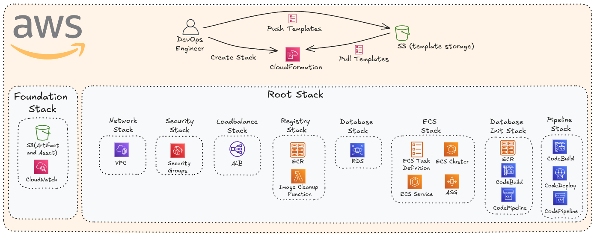
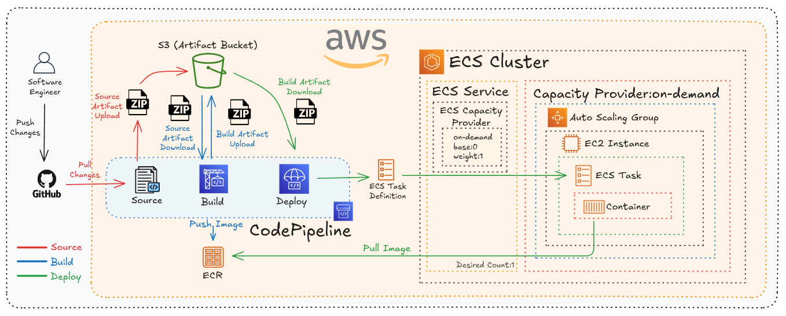
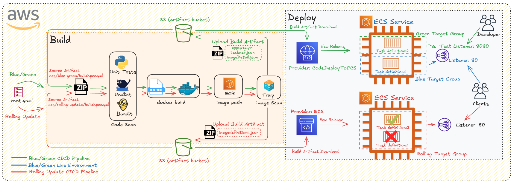
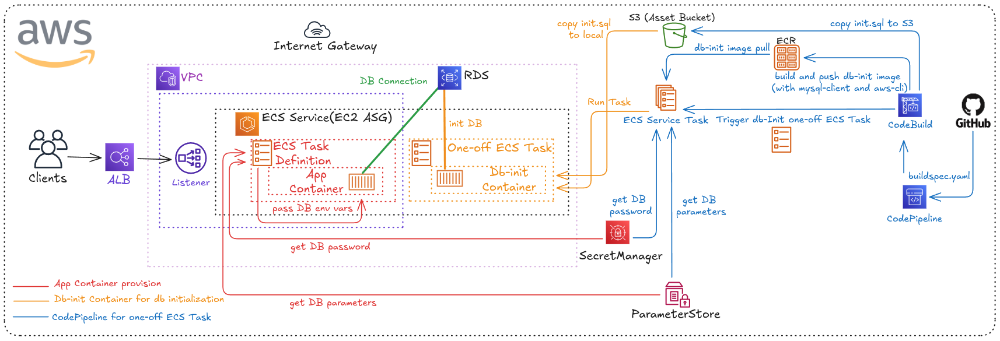

# Ledger App – AWS ECS Portfolio Project

Ledger App is a minimal transactional ledger service built as a **reference portfolio project** to demonstrate an **end‑to‑end, production‑style AWS ECS architecture** built entirely with **CloudFormation (nested stacks)** and deployed via **CodePipeline**.
The goal is to showcase how a containerized application can be deployed in **dev/prod environments** using **rolling update** and **blue/green deployment** strategies, while keeping infrastructure modular, secure, and reproducible.

The application consists of a small Python web service backed by a SQL database. It supports basic CRUD operations and is intentionally kept simple so the infrastructure and pipeline design remain the primary point of interest.


### Project Goals

* Demonstrate **Infrastructure as Code** using CloudFormation
* Implement **CI/CD pipelines** with CodePipeline, CodeBuild, and CodeDeploy
* Support **multiple deployment strategies** (Rolling / Blue‑Green)
* Run workloads on **Amazon ECS (EC2 launch type)** with Capacity Providers
* Securely provision and initialize an **RDS database**
* Separate **one‑time database initialization** from application runtime

### Repository Structure

```text
.
├── infrastructure
│   ├── assets
│   │   ├── database
│   │   │   └── init.sql                # Initial database schema
│   │   └── images
│   │       └── db-init
│   │           └── Dockerfile          # db-init image
│   ├── cicd
│   │   ├── db-init                     # db-init build spec
│   │   │   └── buildspec.yml           
│   │   └── web                         # web-image build artfacts files
│   │       ├── blue-green
│   │       │   ├── appspec.yaml
│   │       │   ├── buildspec.yml
│   │       │   └── taskdef.json
│   │       └── rolling-update
│   │           └── buildspec.yml
│   ├── cloudformation
│   │   ├── compute/ecs
│   │   ├── database
│   │   ├── foundation
│   │   ├── loadbalancer
│   │   ├── network
│   │   ├── pipeline
│   │   ├── registry
│   │   └── security
│   ├── deploy.sh
│   └── local                          # deployment for local development
│       └── docker-compose.yml
├── src                                # app source code
│   └── web
│       ├── app
│       ├── Dockerfile
│       └── tests                      # app unit tests
└── README.md
```

### High‑Level Architecture

The infrastructure is organized into **two logical layers**: Foundation and Root.
  

#### 1. Foundation Stack

Shared resources that rarely change: S3 buckets (artifacts, assets) and CloudWatch Log Groups

These resources export ARNs and names that are later consumed by other stacks.

#### 2. Root Stack

The **orchestrator stack**. It controls environment‑specific behavior using `Mappings` and deploys all nested stacks in the correct order.

Environment differences are handled centrally:

| Environment | Deployment | Branch | ASG | ECS Desired |
| ----------- | ---------- | ------ | --- | ----------- |
| dev         | Rolling    | dev    | 1–2 | 1           |
| prod        | Blue/Green | main   | 2–4 | 2           |

Each major concern is isolated into its own stack:

* **Network** – VPC, public/private subnets, Internet Gateway, Nat Gateway...
* **Security** – Security Groups for ALB, ECS and RDS
* **Load Balance** – ALB, listeners, target groups
* **Registry** – ECR repository and image cleanup lambda function (which is required for stack deletion)
* **Database** – RDS + Secrets Manager + SSM
* **ECS** – Cluster, ASG, Capacity Provider, Service, Task Definiton
* **Database Init** - Image build, one-off ECS task for db-init
* **Pipelines** – CI/CD for web app
  
---

### CI/CD Pipeline Flow
  
  
---

### Deployment Strategies (Rolling vs Blue/Green)
This diagram illustrates how the application is deployed using two different strategies, selected dynamically based on the environment.

Deployment behavior is selected **automatically** via environment mapping.
```text
Mappings:
  EnvConfig:
    dev:
      DeploymentType: rolling
      Branch: dev
    prod:
      DeploymentType: bluegreen
      Branch: main
```



Build phase is shared:

* Source is fetched from GitHub

* Unit tests and static/code security scans are executed

* Docker image is built, scanned, and pushed to ECR

* Build artifacts are uploaded to S3

Deployment phase diverges by strategy:

1.Rolling Update (dev)
The ECS service updates tasks in-place using a single target group.
New task definitions gradually replace old ones behind the same listener (port 80), ensuring minimal disruption with a simpler deployment flow.

2.Blue / Green (prod)
CodeDeploy manages two separate target groups (Blue and Green).
A new task definition is deployed to the Green target group and exposed via a test listener (port 8080).
After validation, traffic is shifted from Blue to Green on the production listener (port 80), allowing safe releases and easy rollback.

This approach keeps the build process consistent while allowing environment-specific deployment behavior without duplicating pipeline logic.

The same pipeline produces different deployment behaviors without changing application code.

---

### Web app container & db-init container lifecycle ##
This diagram shows how the application runtime and database initialization are deliberately separated while still sharing the same ECS environment.


The application container runs as part of an ECS Service behind an ALB and retrieves all database credentials and connection details securely from AWS Secrets Manager and SSM Parameter Store.

The database initialization is handled by a one-off ECS task (db-init) that runs only during environment bootstrap.

The db-init image is built by CodeBuild, pushed to ECR, and executed via ecs run-task.

During execution, the task pulls the SQL schema from S3 and initializes the RDS instance using the MySQL client.

Once completed, the task exits and is never part of the steady-state application lifecycle.

This approach avoids coupling schema creation with application startup and ensures the database is initialized in a controlled, repeatable, and auditable way.

Database initialization is treated as infrastructure, not as application logic.
  
---

### Network Design and Security Model
  
---

### Summary

This project is designed as a **realistic AWS ECS portfolio**:

* Modular CloudFormation design
* Environment‑aware deployments
* Production‑grade CI/CD patterns
* Clean separation of concerns

It aims to reflect how ECS‑based systems are typically structured in real‑world environments rather than minimal demos.

* Keeps application logic simple and auditable
* Emphasizes reproducibility, security, and clarity

It is not a framework or a product, but a **reference implementation** for container‑based delivery pipelines.
